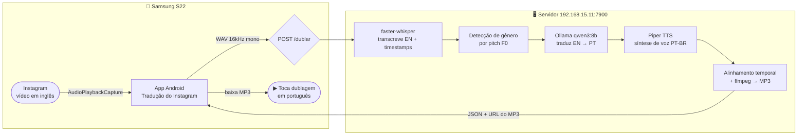

# Tradução do Instagram

Captura o áudio de vídeos em inglês no Instagram e devolve a **dublagem em português**,
sincronizada nos tempos originais e **respeitando voz masculina/feminina** (detecção por F0).

---

## Arquitetura



---

## Fluxo de uso

1. Abrir o app → informar IP do servidor (`192.168.15.11:7900`)
2. Tocar **"2. Iniciar captura"** e aceitar a permissão → gravação começa automaticamente
3. Ir ao Instagram e dar play no vídeo em inglês
4. Voltar ao app e tocar **■ Parar + Dublar**
5. Aguardar o servidor processar (~10–30s)
6. Tocar **▶ Tocar** — a dublagem em português toca enquanto o vídeo abaixa o volume

---

## Instalação do servidor (Linux, user mkinfocell)

```bash
cd ~/ia-workspace
git clone https://github.com/teste0102/Android-traducao.git traducao-instagram
cd traducao-instagram
cp .env.example .env
bash download_models.sh          # baixa voz Piper (1x, ~60 MB)
sudo docker compose up -d --build
sudo docker compose logs -f      # acompanhar: Whisper baixa o modelo small na 1ª vez
```

Testar:
```bash
curl -s http://192.168.15.11:7900/health
# Página de teste: http://192.168.15.11:7900
```

Atualizar após mudanças no código:
```bash
cd ~/ia-workspace/traducao-instagram
git pull
sudo docker compose up -d --build
```

---

## App Android

- APK de debug disponível em [Releases](../../releases) ou compilar com Android Studio
- Requer Android 10+ (API 29) — necessário para `AudioPlaybackCapture`
- Permissões necessárias: captura de mídia, overlay de janela, notificações

---

## API

### `POST /dublar`
Envia áudio/vídeo e recebe a dublagem:
```bash
curl -s -F "file=@clipe.wav" http://192.168.15.11:7900/dublar
```
Resposta JSON:
```json
{
  "language": "en",
  "duration": 12.4,
  "tts_mode": "piper-native",
  "audio_url": "/audio/abc123?fmt=mp3",
  "segments": [
    { "start": 0.0, "end": 3.2, "gender": "male", "en": "Hello", "pt": "Olá" }
  ]
}
```

### `GET /audio/{job}?fmt=mp3`
Baixa o arquivo de áudio dublado.

### `GET /health`
Verifica se o servidor está no ar.

---

## Variáveis de ambiente (.env)

| Variável | Padrão | Descrição |
|---|---|---|
| PORT | 7900 | Porta do servidor |
| WHISPER_MODEL | small | Tamanho do modelo (tiny/base/small/medium) |
| WHISPER_DEVICE | cpu | `cpu` ou `cuda` |
| OLLAMA_URL | http://host.docker.internal:11434 | Ollama no host |
| OLLAMA_MODEL | qwen3:8b | Modelo tradutor |
| GENDER_F0_THRESHOLD | 165 | Hz: abaixo=masculino, acima=feminino |
| FEMALE_PITCH_FALLBACK | 3.5 | Semitons para voz feminina por pitch-shift |
| MAX_SPEEDUP | 1.6 | Aceleração máxima para encaixar fala longa |

---

## Pipeline de processamento

```
Áudio EN (WAV)
    │
    ▼
faster-whisper ──► segmentos com timestamps + idioma detectado
    │
    ▼
Detecção de gênero por F0 (autocorrelação, threshold 165 Hz)
    │
    ├── masculino → Piper faber-medium
    └── feminino  → Piper female.onnx (ou faber + pitch-shift +3.5 st)
    │
    ▼
Ollama qwen3:8b ──► tradução EN→PT em lote (numerada)
    │
    ▼
Piper TTS ──► síntese de voz PT-BR por segmento
    │
    ▼
Alinhamento temporal (numpy float32, atempo até 1.6×)
    │
    ▼
ffmpeg ──► MP3 final
```
